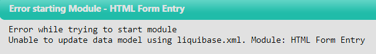

# Bijlagen-overzicht — Auditrapport HTML Form Entry Module

---

## Bijlage A — Traceability matrix

| Vereiste | Bestand/Link |
|---|---|
| Traceability matrix (NEN-7510 control → maatregel → vóór → aanpassing → na) | [Traceability matrix](../overige/Threat%20model/ThreatModel.md) |

*Beschikbare bron in project:* `docs/overige/Traceability-Matrix.md`

---

## Bijlage B — SBOM (CycloneDX JSON)

| Vereiste | Bestand/Link |
|---|---|
| Volledige SBOM JSON (build-tijd, dagelijkse CI-run) | [SBOM (dagelijks)](artifacts/sbom-cyclonedx-anchore/sbom.cyclonedx.json) |
| SBOM van de wekelijkse geplande scan (indien afwijkend) | [SBOM (wekelijks)](artifacts/sbom-cyclonedx-anchore/sbom.cyclonedx.json) |

*Beschikbare bronnen in project:* `artifacts/sbom-cyclonedx-anchore/sbom.cyclonedx.json`

---

## Bijlage C — SAST- en SCA-output

| Vereiste | Bestand/Link |
|---|---|
| CodeQL SARIF-output (eindmeting) | [CodeQL SARIF](artifacts/codeql-sarif/java.sarif) |
| OSV-Scanner SARIF-output (eindmeting) | [OSV-Scan Report](artifacts/OSV%20Scanner%20SARIF%20file/results.sarif) |
| Dependabot alerts log | [Depandabot Alert Logs](artifacts/build-artifacts) |
| JaCoCo coverage-rapport (per module) | [JaCoCo coverage-rapport](artifacts/coverage-report/) |

*Beschikbare bronnen in project:* `artifacts/codeql-sarif/java.sarif`, `artifacts/OSV Scanner SARIF file/results.sarif`, `artifacts/coverage-report/`

---

## Bijlage D — Risicomatrix en security backlog

| Vereiste | Bestand/Link |
|---|---|
| Risicomatrix — initieel | [Risicomatrix initieel](../overige/Risicomatrix/RiskMatrixHtmlformentryInitial.png) |
| Risicomatrix — residueel | [Risicomatrix residueel](../overige/Risicomatrix/RiskMatrixHtmlformentryResidual.png) |
| Risicoanalyse (deel 1 en 2) | [Risicomatrix deel 1](../overige/Risicomatrix/RisicoAnalyseDeel1.png) [Risicomatrix deel 2](../overige/Risicomatrix/RisicoAnalyseDeel2.png) |
| Security backlog (volledige lijst SB-1 t/m SB-20) | [Security Backlog](../overige/Security-Requirements.md) |
| Risk Assessment Report | [Risk Assessment Rapport](../overige/RiskAssesmentRapport.md) |

*Beschikbare bronnen in project:* `docs/overige/Risicomatrix/`, `docs/overige/Security-Requirements.md`, `docs/overige/RiskAssesmentRapport.md`

---

## Bijlage E — Bow-tie diagrammen / threat model

| Vereiste | Bestand/Link |
|---|---|
| Bow-tie: Toegang patiëntgegevens | [Bow-tie: Toegang patiëntgegevens](../overige/Bow-Ties/bow-tie-Toegang-Patientgegevens.png) |
| Bow-tie: Wijziging medische gegevens | [Bow-tie: Wijziging medische gegevens](../overige/Bow-Ties/bow-tie-gebruikersacounts-toegang-medische-gegevens.png) |
| Bow-tie: Gebruik externe softwarecomponenten | [Bow-tie: Gebruik externe softwarecomponenten](../overige/Bow-Ties/bow-tie-gebruik-externe-softwarecomponenten.png) |
| Bow-tie: Gebruikersaccounts toegang medische gegevens | [Bow-tie: Gebruikersaccounts toegang medische gegevens](../overige/Bow-Ties/bow-tie-gebruikersacounts-toegang-medische-gegevens.png) |
| Threat model (IriusRisk, C4-diagrammen) | [Threat Model](../overige/Threat%20model/ThreatModel.md) |

*Beschikbare bronnen in project:* `docs/overige/Bow-Ties/`, `docs/overige/Threat model/`

---

## Bijlage F — Penetratietestplan en onderbouwing

| Vereiste | Bestand/Link |
|---|---|
| Penetratietestplan (PT-01 t/m PT-07) | [Pentrationtestplan](../overige/Pentesting/penentrationtestplan.md) |
| Onderbouwing niet-uitvoering pentest | [Onderbouwing Pentesten](../overige/Pentesting/Onderbouwing-Pentesten.md) |
| Screenshot installatiefout (Liquibase) |  |

*Beschikbare bronnen in project:* `docs/overige/Pentesting/`

---

## Bijlage G — Gap-analyse

| Vereiste | Bestand/Link |
|---|---|
| Algemene gap-analyse (8.16, 8.28, 8.8) | [Gap Analyse](../overige/gapAnalyse.md) |
| Gap-analyse logging (8.15, attack surface-koppeling) | [Attack Surface Mapping](../overige/Attack-surface-mapping.md) |

*Beschikbare bron in project:* `docs/overige/gapAnalyse.md`

---

## Bijlage H — AI-tooling verantwoording

> Niet automatisch gegenereerd — vul dit zelf in volgens het format uit de WS06-slides ("Wat ik aan AI heb gevraagd", "Wat de AI heeft gegenereerd", "Wat ik zelf heb gecontroleerd", "Beslissingen die ik zelf heb gemaakt").

| Vereiste | Bestand/Link |
|---|---|
| AI-tooling verantwoordingsdocument | [AI-Tooling Verantwoording](../) |

---

## Niet meegenomen (per instructie van de gebruiker)

De volgende bijlagen uit de standaard WS06-structuur zijn **niet** opgenomen omdat ze niet van toepassing zijn op dit project:

- **CRA-mapping als losse bijlage** — de CRA-koppeling is al inhoudelijk verwerkt in hoofdstuk 5.5 van het auditrapport zelf.
- **Snyk-rapport** — er is geen Snyk gebruikt; de SCA-functie wordt vervuld door Dependabot + OSV-Scanner (zie Bijlage C).

Indien je deze later alsnog wilt toevoegen (bijvoorbeeld als je team alsnog Snyk inzet), voeg dan een rij toe aan de bijlagentabel in `Auditrapport.md` sectie 7 en aan dit overzicht.
