# Verbeteronderzoek Onderhoudbaarheid

## 1. Analyse onderhoudbaarheid
### Doel

Het doel van deze analyse is om de huidige onderhoudbaarheid van de HTML Form Entry Module in kaart te brengen voordat er verbeteringen worden uitgevoerd. Hiervoor is gebruikgemaakt van SonarQube Cloud.

De analyse richt zich op:
- code smells
- maintainability
- duplicatie
- test coverage

### Uitgevoerde analyse

De eerste SonarQube-analyse gaf de volgende resultaten:

| Onderdeel              | Resultaat         |
|------------------------|-------------------|
| Quality Gate           | Failed            |
| Maintainability Rating | B                 |
| Coverage on New Code   | 0%                |
| Code smells            | Meerdere gevonden |

De Quality Gate faalde omdat de nieuwe code geen test coverage had en de maintainability rating onder de vereiste waarde zat.
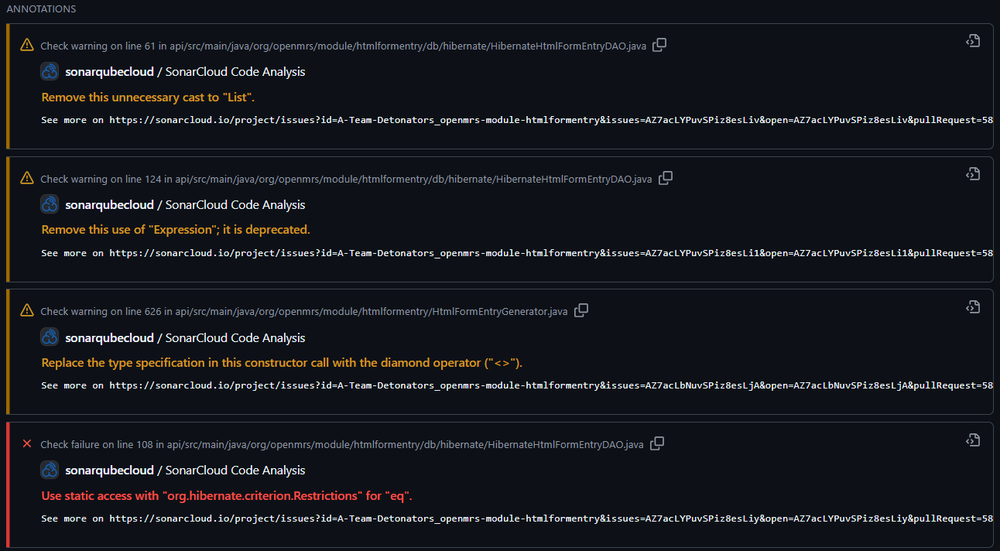
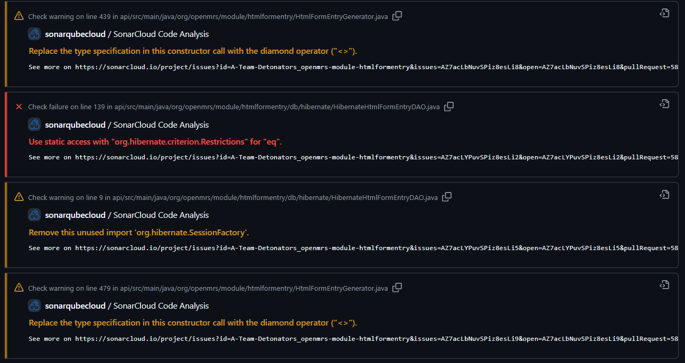
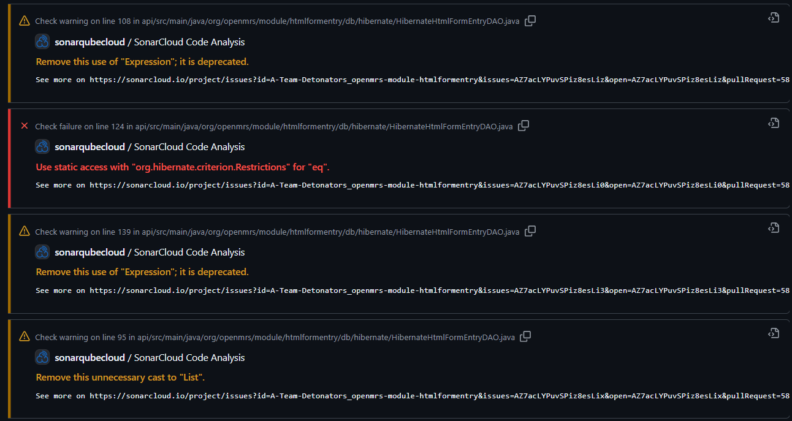
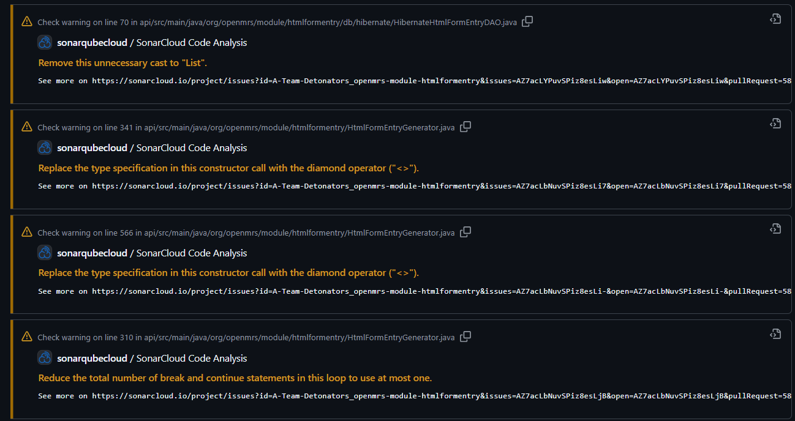
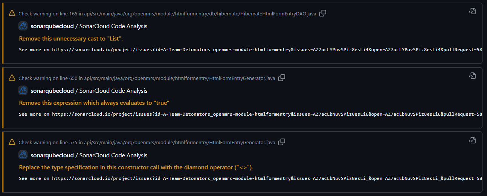


## 2. Testopzet en testresultaten
### Testdoel

Voor de refactor zijn tests uitgevoerd om vast te leggen dat de huidige functionaliteit correct werkt. Deze resultaten dienen als vergelijking voor de situatie na de verbeteringen.

### Testuitvoering

De bestaande tests binnen de module zijn uitgevoerd met:

```
mvn test
```

### Resultaten:
We hebben ``` mvn test ``` uitgevoerd en de logs aan Claude gegeven om een samenvatting te maken van alle verschillende testresultaten in 1 totaal zie afbeelding 3:


Conclusie:

De bestaande functionaliteit werkt correct. Hierdoor kan de refactor uitgevoerd worden zonder dat bestaande problemen worden verward met nieuwe fouten.
## 3. Verbeteringen (prioritering en onderbouwing)

Op basis van de analyse is gekozen om de problemen op te lossen in deze volgorde:

| Rank | Issue                                                                                     |
|------|-------------------------------------------------------------------------------------------|
| 1    | Use static access with `org.hibernate.criterion.Restrictions` for `eq`.                   |
| 2    | Remove this use of `Expression`; it is deprecated.                                        |
| 3    | Remove this expression which always evaluates to `true`.                                  |
| 4    | Remove this unnecessary cast to `List`.                                                   |
| 5    | Remove this unused import `org.hibernate.SessionFactory`.                                 |
| 6    | Reduce the total number of break and continue statements in this loop to use at most one. |
| 7    | Replace the type specification in this constructor call with the diamond operator (`<>`). |

## 4. Aangepast ontwerp

## 5. Realisatie (PoC) & verantwoording

### Uitwerkingen Issues
#### 1 en 2. Use static access with `org.hibernate.criterion.Restrictions` for `eq`,  Remove this use of `Expression`; it is deprecated.
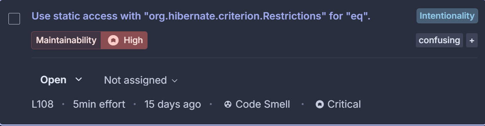
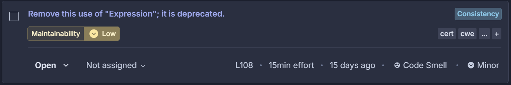
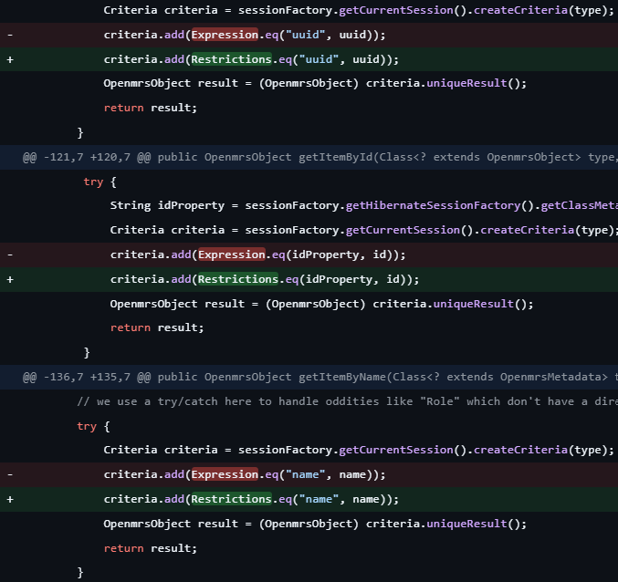
Zoals te zien in deze screenshots was Expression deprecated, dit hebben we opgelosd door Restrictions te gebruiken, het doet hetzelfde alleen Restrictions is de vernieuwde versie. Nadat we dat hebben gedaan hebben we de oude import verwijdert

#### 3. remove this expression which always evaluates to `true`
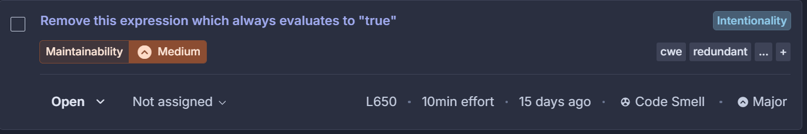
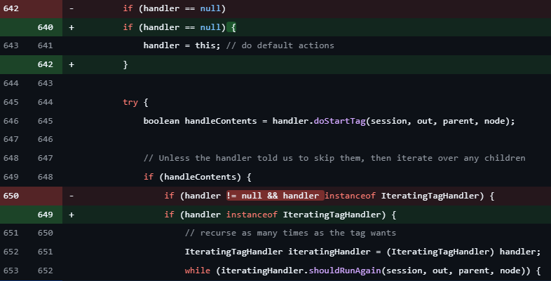

#### 4. Remove this unnecessary cast to `List`
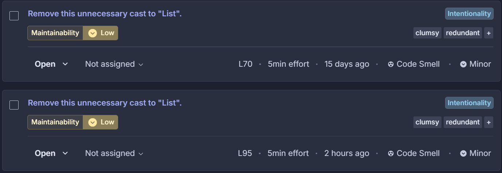
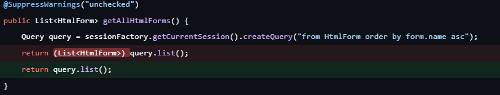
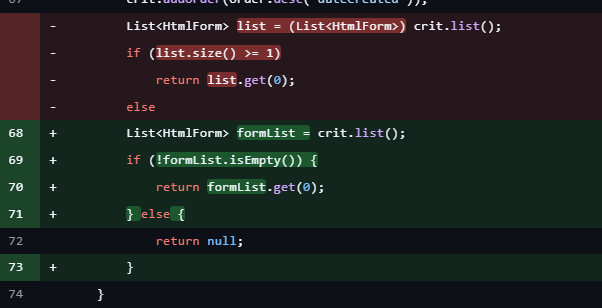
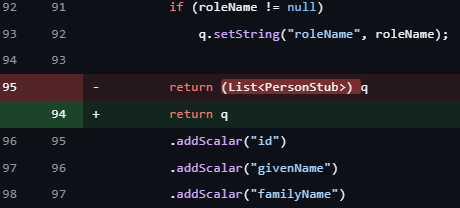
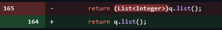

#### 5. Remove this unused import `org.hibernate.SessionFactory`
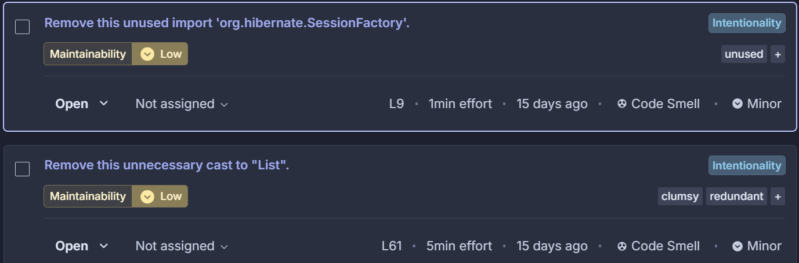
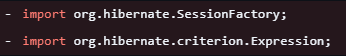
Zoals je kan zien was er 1 ongebruikte dependency voordat we gingen refactoren, die hebben we verwijdert en uiteindelijk was natuurlijk ook de dependency van de expression niet meer in gebruik, dus die kon ook weg

#### 6. Reduce the total number of break and continue statements in this loop to use at most one
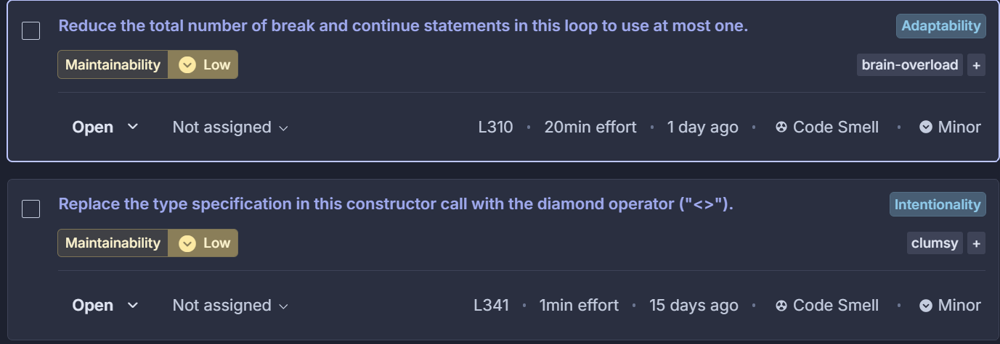
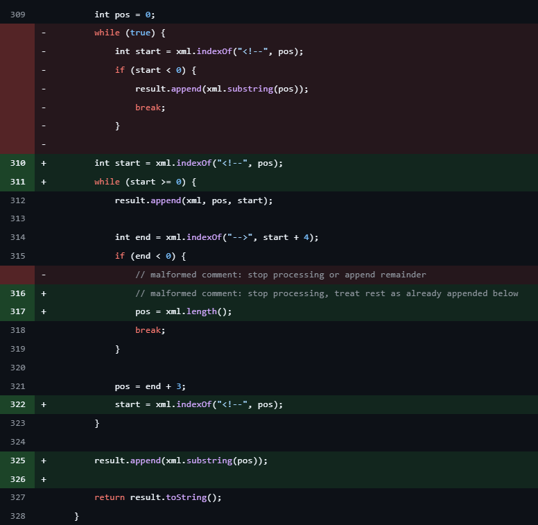

#### 7. Replace the type specification in this constructor call with the diamond operator (`<>`)
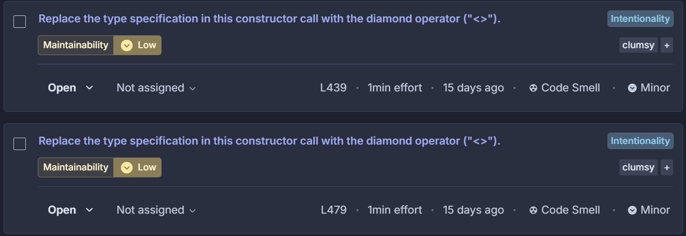
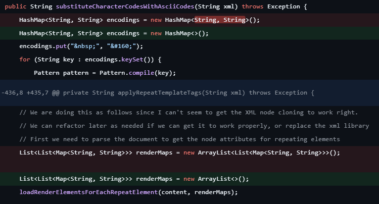
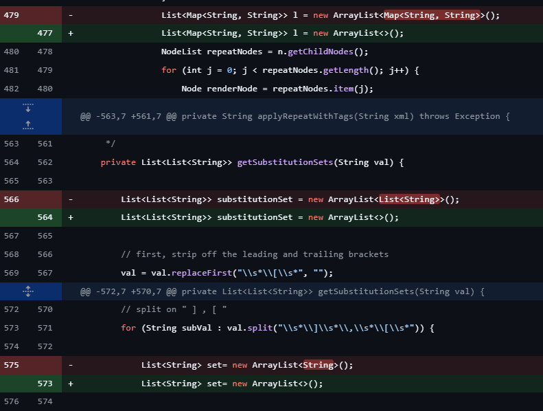
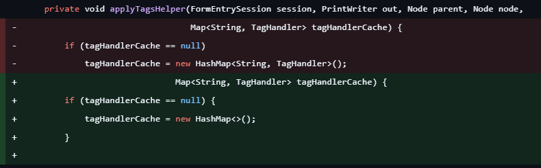
Zoals je kunt zien in de screenshots waren er een heleboel type specifications die verandert konden worden naar de diamond operator (`<>`)

### Tooling

Gebruikte tooling:
- SonarQube Cloud voor codeanalyse
- Maven voor uitvoeren van tests
- GitHub Actions voor automatische analyse
- IntelliJ IDEA en VS Code voor codeaanpassingen  
AI tooling is gebruik als ondersteuning op onze werkzaamheden, het beter begrijpen van foutmeldingen en codesuggesties, het resultaat daarvan is eerst kritisch bekeken en aangepast waar nodig voordat het in gebruik genomen werd.

## 6. Validatie verbeteringen
Na de wijzigingen is opnieuw een SonarQube-analyse uitgevoerd.


Daarnaast zijn dezelfde tests opnieuw uitgevoerd:

```
mvn test
```

Resultaat: