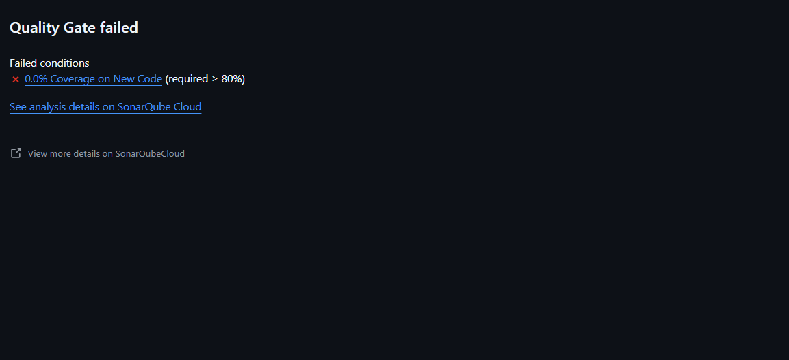
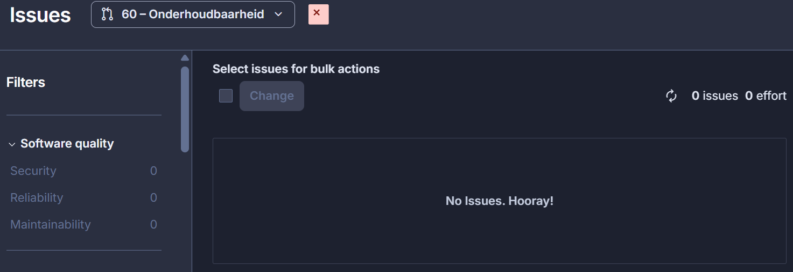
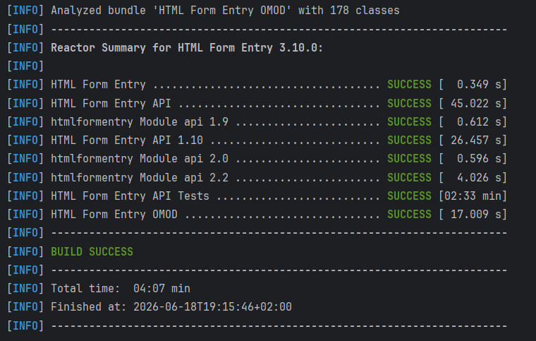
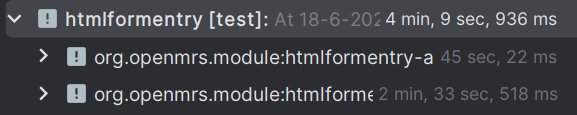
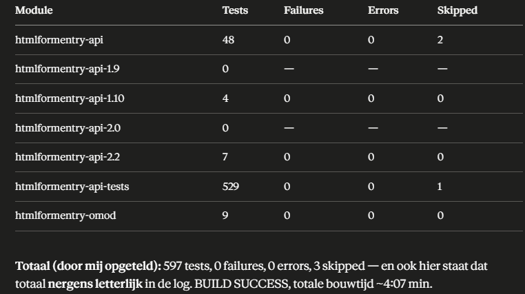

# Verbeteronderzoek Onderhoudbaarheid

## 1. Analyse onderhoudbaarheid
### Doel

Het doel van deze analyse is om de huidige onderhoudbaarheid van de HTML Form Entry Module in kaart te brengen voordat er verbeteringen worden uitgevoerd. Hiervoor is gebruikgemaakt van SonarQube Cloud.

De analyse richt zich op:
- code smells
- maintainability
- duplicatie
- test coverage

### Uitgevoerde analyse

De eerste SonarQube-analyse gaf de volgende resultaten:

| Onderdeel              | Resultaat         |
|------------------------|-------------------|
| Quality Gate           | Failed            |
| Maintainability Rating | B                 |
| Coverage on New Code   | 0%                |
| Code smells            | Meerdere gevonden |

De Quality Gate faalde omdat de nieuwe code geen test coverage had en de maintainability rating onder de vereiste waarde zat.


## 2. Testopzet en testresultaten
### Testdoel

Voor de refactor zijn tests uitgevoerd om vast te leggen dat de huidige functionaliteit correct werkt. Deze resultaten dienen als vergelijking voor de situatie na de verbeteringen.

### Testuitvoering

De bestaande tests binnen de module zijn uitgevoerd met:

```
mvn test
```

### Resultaten:
We hebben ``` mvn test ``` uitgevoerd en de logs aan Claude gegeven om een samenvatting te maken van alle verschillende testresultaten in 1 totaal zie afbeelding 3:


Conclusie:

De bestaande functionaliteit werkt correct. Hierdoor kan de refactor uitgevoerd worden zonder dat bestaande problemen worden verward met nieuwe fouten.
## 3. Verbeteringen (prioritering en onderbouwing)

Op basis van de analyse is gekozen om de problemen op te lossen in deze volgorde:

| Rank | Issue                                                                                     |
|------|-------------------------------------------------------------------------------------------|
| 1    | Use static access with `org.hibernate.criterion.Restrictions` for `eq`.                   |
| 2    | Remove this use of `Expression`; it is deprecated.                                        |
| 3    | Remove this expression which always evaluates to `true`.                                  |
| 4    | Remove this unnecessary cast to `List`.                                                   |
| 5    | Remove this unused import `org.hibernate.SessionFactory`.                                 |
| 6    | Reduce the total number of break and continue statements in this loop to use at most one. |
| 7    | Replace the type specification in this constructor call with the diamond operator (`<>`). |

## 4. Onderhoudbaarheidsrefactor — Aangepast Ontwerp

## Inleiding

Naar aanleiding van SonarQube-bevindingen is een onderhoudbaarheidsrefactor uitgevoerd op drie onderdelen van de codebase: `stripComments`, `applyTagsHelper` en `getHtmlFormByForm`. De wijzigingen zijn gericht op leesbaarheid, type-veiligheid en het verlagen van cyclomatische complexiteit, zonder functioneel gedrag te veranderen.

---

## 1. `stripComments` — Meerdere `break`-statements in één loop

**Sonar-melding:** _Reduce the total number of break and continue statements in this loop to use at most one._

**Probleem:** De `while (true)`-loop bevatte twee `break`-statements: één voor het geval er geen `<!--` meer werd gevonden, en één voor een misvormd commentaarblok. Dit verhoogt de cyclomatische complexiteit en maakt de uitvoerflow moeilijker te volgen.

**Toegepast principe:** _Replace Nested Conditional with Guard Clauses_ (Fowler) — de eerste `break` is geëlimineerd door de loop-conditie te wijzigen van `while (true)` naar `while (start >= 0)`. De loop stopt nu vanzelf op de juiste conditie; er blijft precies één `break` over voor het misvormd-commentaar-geval.

```java
// Voor
while (true) {
    int start = xml.indexOf("<!--", pos);
    if (start < 0) {
        result.append(xml.substring(pos));
        break; // break #1
    }
    ...
    if (end < 0) break; // break #2
    pos = end + 3;
}

// Na
int start = xml.indexOf("<!--", pos);
while (start >= 0) {
    result.append(xml, pos, start);
    int end = xml.indexOf("-->", start + 4);
    if (end < 0) { pos = xml.length(); break; } // enige break
    pos = end + 3;
    start = xml.indexOf("<!--", pos);
}
result.append(xml.substring(pos));
```

**Overwogen alternatieven:**
- _Booleaanse vlag_ (`while (start >= 0 && !malformed)`): verwijdert alle `break`-statements, maar voegt een extra toestandsvariabele toe die de leesbaarheid niet ten goede komt voor een methode van deze omvang.
- _Regex_ (`<!--.*?-->`): kortere implementatie, maar onbetrouwbaarder bij misvormde of geneste commentaarblokken. Buiten scope van de melding en hogere regressiekans.

---

## 2. Diamond Operator bij Generic Collecties

**Sonar-melding:** _Replace the type specification in this constructor call with the diamond operator (`<>`)._

**Probleem:** Generic types werden zowel links (declaratie) als rechts (constructor) uitgeschreven, wat een schending is van het DRY-principe.

**Toegepast principe:** _Don't Repeat Yourself_ — de compiler leidt het type rechts af uit de declaratie links. Expliciete herhaling is overbodig en vergroot het risico dat de twee kanten bij toekomstige aanpassingen uit elkaar lopen.

```java
// Voor
HashMap<String, String> encodings = new HashMap<String, String>();
List<List<Map<String, String>>> renderMaps = new ArrayList<List<Map<String, String>>>();

// Na
HashMap<String, String> encodings = new HashMap<>();
List<List<Map<String, String>>> renderMaps = new ArrayList<>();
```

**Overwogen alternatieven:**
- _`var`_ (Java 10+): plaatst het type alleen rechts, maar maakt de declaratie minder leesbaar bij geneste generics (`List<List<Map<String,String>>>`). Past ook minder goed bij de bestaande codestijl.

---

## 3. `applyTagsHelper` — Redundante null-check en inconsistente stijl

### 3a. Altijd-ware expressie

**Sonar-melding:** _Remove this expression which always evaluates to "true"._

**Probleem:** De conditie `handler != null && handler instanceof IteratingTagHandler` bevat een overbodige null-check. Enkele regels eerder wordt `handler` gegarandeerd niet-null gemaakt (`if (handler == null) handler = this;`). Bovendien retourneert `instanceof` altijd `false` voor `null`, waardoor de null-check functioneel nooit iets toevoegt.

**Toegepast principe:** _Eliminate Dead/Redundant Code_ — de null-check is verwijderd. Dit elimineert ook de misleidende suggestie dat `null` hier een reëel scenario zou zijn.

```java
// Voor
if (handler != null && handler instanceof IteratingTagHandler) {

// Na
if (handler instanceof IteratingTagHandler) {
```

### 3b. Inconsistente blokstructuur

**Probleem (code review):** `if`-statements werden inconsistent geschreven: soms met accolades, soms zonder.

**Toegepast principe:** _Coding Standard Conformance_ — alle `if`-bodies hebben nu altijd accolades, ook bij één-regelige bodies. Dit volgt de Google Java Style Guide en voorkomt subtiele bugs bij toekomstige uitbreidingen. Tevens is een overbodig anoniem codeblok (`{ ... }`) rond de handler-lookup verwijderd, dat geen scope-doel had en alleen visuele ruis toevoegde.

**Overwogen alternatief:**
- _Extract Method_ voor de handler-lookup: legitiem en bevordert Single Responsibility, maar valt buiten de scope van de concrete Sonar-meldingen. Aanbevolen voor een vervolgrefactor.

---

## 4. `getHtmlFormByForm` — Raw Type, Onnodige Cast en Naamgeving

**Sonar-meldingen:**
1. _Remove this unnecessary cast to "List"._
2. _Rename this local variable to match `^[a-z][a-zA-Z0-9]*$`._
3. _Provide the parametrized type for this generic._

**Probleem:** De methode gebruikte eerst een raw `List` (zonder generic-parameter) en paste vervolgens een aparte cast toe naar `List<HtmlForm>`. Dit zijn twee stappen waar één volstaat. Daarnaast begon de variabelenaam `FormList` met een hoofdletter, wat in Java gereserveerd is voor klassenamen.

**Toegepaste principes:**
- _Generics / Type Safety_ (Effective Java, Item 26): raw types ontnemen de compiler de mogelijkheid om type-fouten vroeg te detecteren. Door de cast en parametrisatie samen te voegen in één stap blijft er precies één onvermijdelijke `@SuppressWarnings("unchecked")` cast over (vanwege de raw `List` die Hibernate's `Criteria.list()` retourneert — een API-beperking).
- _Naming Convention Conformance_: hernoemd naar `formList`.

```java
// Voor
List list = crit.list();
List<HtmlForm> FormList = (List<HtmlForm>) list;
if (list.size() >= 1)
    return FormList.get(0);

// Na
List<HtmlForm> formList = (List<HtmlForm>) crit.list();
if (formList.size() >= 1) {
    return formList.get(0);
}
```

**Overwogen alternatieven:**
- _`Optional<HtmlForm>` als retourtype_: moderne Java-praktijk die explicieter maakt dat een waarde kan ontbreken, maar dit is een breaking change voor alle bestaande aanroepers. Bewust niet meegenomen in deze refactorronde; aanbevolen als aparte, gedocumenteerde API-wijziging.
- _`!formList.isEmpty()` in plaats van `size() >= 1`_: kleine leesbaarheidsverbetering zonder Sonar-melding als aanleiding; niet meegenomen om de refactor gericht te houden.

---

## Samenvatting

| Onderdeel | Sonar-issue | Toegepast principe |
|---|---|---|
| `stripComments` | Meerdere `break`-statements | Guard clause via loop-conditie |
| Generieke collecties | Geen diamond operator | DRY |
| `applyTagsHelper` | Altijd-ware expressie | Eliminate Dead Code |
| `applyTagsHelper` | Inconsistente blokstijl | Coding Standard Conformance |
| `getHtmlFormByForm` | Raw type + onnodige cast | Generics / Type Safety |
| `getHtmlFormByForm` | Variabelenaam niet conform conventie | Naming Convention Conformance |

Alle wijzigingen zijn minimaal en gericht: grotere structurele ingrepen (Extract Method, Optional-retourtype, Strategy-klasse) zijn bewust uitgesteld omdat ze de scope van de concrete Sonar-bevindingen te buiten gaan en een hoger regressierisico met zich meebrengen.

## 5. Realisatie (PoC) & verantwoording

### Uitwerkingen Issues
#### 1 en 2. Use static access with `org.hibernate.criterion.Restrictions` for `eq`,  Remove this use of `Expression`; it is deprecated.


Zoals te zien in deze screenshots was Expression deprecated, dit hebben we opgelosd door Restrictions te gebruiken, het doet hetzelfde alleen Restrictions is de vernieuwde versie. Nadat we dat hebben gedaan hebben we de oude import verwijdert

#### 3. remove this expression which always evaluates to `true`


Zoals je kunt zien hebben we in de if statement de '!=null' weggehaald omdat die overbodig was.

#### 4. Remove this unnecessary cast to `List`


Zoals je kunt zien hebben we bij alle code waar zo'n Unnecessary cast gebruikt was omgeschreven zodat er geen cast meer wordt gedaan.

#### 5. Remove this unused import `org.hibernate.SessionFactory`


Zoals je kan zien was er 1 ongebruikte dependency voordat we gingen refactoren, die hebben we verwijdert en uiteindelijk was natuurlijk ook de dependency van de expression niet meer in gebruik, dus die kon ook weg

#### 6. Reduce the total number of break and continue statements in this loop to use at most one


Zoals je kunt zien hebben we de While statement aangepast zodat er nog maar 1 break in de code staat.

#### 7. Replace the type specification in this constructor call with the diamond operator (`<>`)


Zoals je kunt zien in de screenshots waren er een heleboel type specifications die verandert konden worden naar de diamond operator (`<>`)

### Tooling

Gebruikte tooling:
- SonarQube Cloud voor codeanalyse
- Maven voor uitvoeren van tests
- GitHub Actions voor automatische analyse
- IntelliJ IDEA en VS Code voor codeaanpassingen  
AI tooling is gebruik als ondersteuning op onze werkzaamheden, het beter begrijpen van foutmeldingen en codesuggesties, het resultaat daarvan is eerst kritisch bekeken en aangepast waar nodig voordat het in gebruik genomen werd.

## 6. Validatie verbeteringen
Na de wijzigingen is opnieuw een SonarQube-analyse uitgevoerd.


Zoals je hier kunt zien staan er nu geen Issues meer open in SonarQube.

Daarnaast zijn dezelfde tests opnieuw uitgevoerd:

```
mvn test
```

Resultaat:



Zoals je kunt zien zijn de testen nog steeds geslaagd.