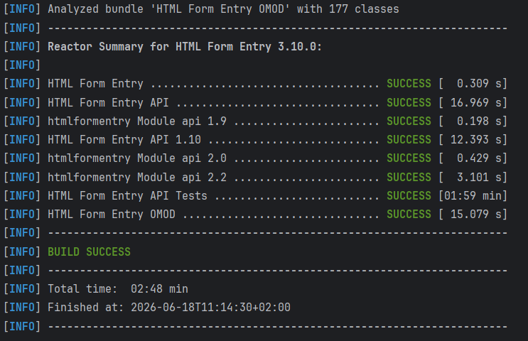
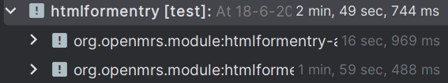
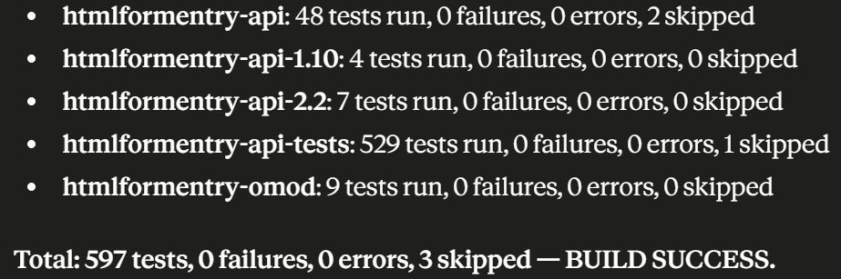

# Verbeteronderzoek Onderhoudbaarheid

## 1. Analyse onderhoudbaarheid
### Doel

Het doel van deze analyse is om de huidige onderhoudbaarheid van de HTML Form Entry Module in kaart te brengen voordat er verbeteringen worden uitgevoerd. Hiervoor is gebruikgemaakt van SonarQube Cloud.

De analyse richt zich op:
- code smells
- maintainability
- duplicatie
- test coverage

### Uitgevoerde analyse

De eerste SonarQube-analyse gaf de volgende resultaten:

| Onderdeel              | Resultaat         |
|------------------------|-------------------|
| Quality Gate           | Failed            |
| Maintainability Rating | B                 |
| Coverage on New Code   | 0%                |
| Code smells            | Meerdere gevonden |

De Quality Gate faalde omdat de nieuwe code geen test coverage had en de maintainability rating onder de vereiste waarde zat.


## 2. Testopzet en testresultaten
### Testdoel

Voor de refactor zijn tests uitgevoerd om vast te leggen dat de huidige functionaliteit correct werkt. Deze resultaten dienen als vergelijking voor de situatie na de verbeteringen.

### Testuitvoering

De bestaande tests binnen de module zijn uitgevoerd met:

```
mvn test
```

### Resultaten:
We hebben ``` mvn test ``` uitgevoerd en de logs aan Claude gegeven om een samenvatting te maken van alle verschillende testresultaten in 1 totaal zie afbeelding 3:




Conclusie:

De bestaande functionaliteit werkt correct. Hierdoor kan de refactor uitgevoerd worden zonder dat bestaande problemen worden verward met nieuwe fouten.
## 3. Verbeteringen (prioritering en onderbouwing)

Op basis van de analyse zijn verbeteringen gekozen.

## 4. Aangepast ontwerp

## 5. Realisatie (PoC) & verantwoording

### Tooling

Gebruikte tooling:
- SonarQube Cloud voor codeanalyse
- Maven voor uitvoeren van tests
- GitHub Actions voor automatische analyse
- IntelliJ IDEA en VS Code voor codeaanpassingen  
AI tooling is gebruik als ondersteuning op onze werkzaamheden, het beter begrijpen van foutmeldingen en codesuggesties, het resultaat daarvan is eerst kritisch bekeken en aangepast waar nodig voordat het in gebruik genomen werd.

## 6. Validatie verbeteringen
Na de wijzigingen is opnieuw een SonarQube-analyse uitgevoerd.

Daarnaast zijn dezelfde tests opnieuw uitgevoerd:

```
mvn test
```

Resultaat: