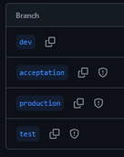
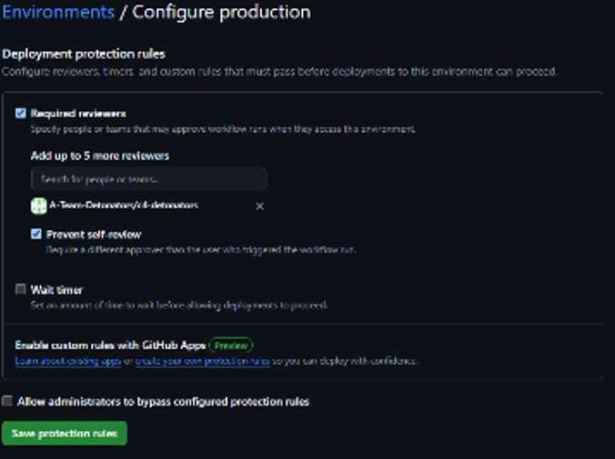
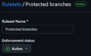
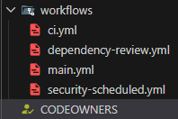
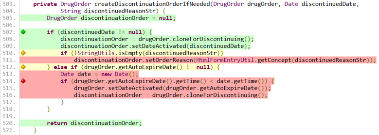
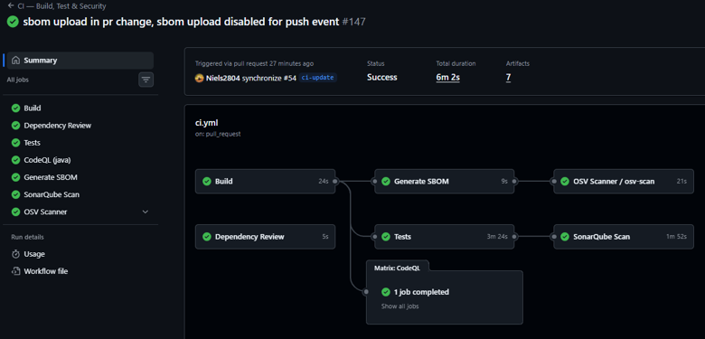
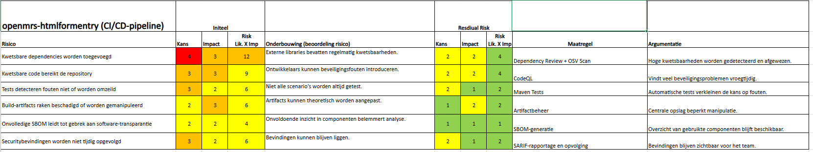
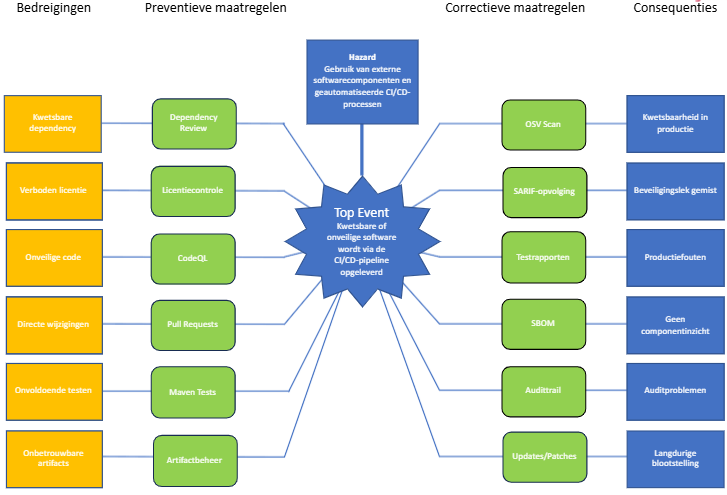

# GitHub gerelateerde zaken

## 1 Inrichting van de GitHub-organisatie en CI/CD-pipeline

### 1.1 Hoe is de organisatie opgebouwd?

Voor dit project is binnen GitHub een organisatie aangemaakt met de naam A-Team-Detonators. Binnen deze organisatie zijn de repositories ondergebracht die gebruikt worden voor de ontwikkeling van de applicatie. Daarnaast zijn op organisatieniveau verschillende regels geconfigureerd. Deze organisation rules zijn leidend en zorgen ervoor dat beveiligings- en kwaliteitsmaatregelen consistent worden toegepast binnen alle gekoppelde repositories.

### 1.2 OTAP (Ontwikkeling – Test – Acceptatie – Productie)

Binnen het project wordt gewerkt volgens het OTAP-principe. Hiervoor zijn vier hoofdtakken ingericht: dev, test, acceptation en production. Elke branch vertegenwoordigt een eigen fase binnen het ontwikkelproces. Nieuwe functionaliteiten worden eerst ontwikkeld in de ontwikkelomgeving en doorlopen vervolgens de test- en acceptatiefase voordat deze uiteindelijk naar productie worden gebracht. Hierdoor worden wijzigingen gecontroleerd en stapsgewijs doorgevoerd, wat het risico op fouten in productie verkleint.

### 1.3 GitHub Environments

Voor de verschillende omgevingen zijn GitHub Environments ingericht. Met name voor de productieomgeving zijn aanvullende beveiligingsmaatregelen geconfigureerd. Deze omgevingen maken het mogelijk om specifieke deployment-regels toe te passen, voordat een release daadwerkelijk wordt uitgerold.

### 1.4 Protection Rules

Om de belangrijkste branches te beschermen, zijn Branch Protection Rules ingesteld. Hierdoor kunnen wijzigingen niet rechtstreeks op beschermde branches worden doorgevoerd. Aanpassingen moeten via een pull request verlopen en force pushes worden geblokkeerd. Daarnaast vervallen eerder gegeven goedkeuringen wanneer na de review nog wijzigingen aan de pull request worden toegevoegd. Dit draagt bij aan een beheerst wijzigingsproces en vergroot de traceerbaarheid.

### 1.5 Approval Gates

Binnen de CI/CD-pipeline zijn meerdere goedkeuringsmomenten ingericht. Voordat een pull request kan worden gemerged, is minimaal één goedkeuring vereist. Daarnaast is voor deployments naar de productieomgeving een afzonderlijke approval gate ingesteld. De gebruiker die de deployment initieert, mag deze niet zelf goedkeuren (prevent self-review). Hiermee wordt het vier-ogenprincipe toegepast en wordt functiescheiding afgedwongen.

#### 1.5.1 CODEOWNERS

CODEOWNERS is een mechanisme dat bepaalt wie verantwoordelijk is voor het beoordelen van wijzigingen in de code. Op basis van de bestanden die worden aangepast in een pull request, worden automatisch de juiste reviewers toegewezen. Hierdoor wordt gewaarborgd dat wijzigingen altijd door een verantwoordelijke ontwikkelaar worden gecontroleerd voordat ze worden samengevoegd.

### 1.6 NEN 7510-controls voor de CI/CD

De inrichting van de CI/CD-pipeline ondersteunt verschillende beheersmaatregelen uit NEN 7510:2024-2. De branchbeveiliging en approval gates sluiten aan bij 5.3 (Scheiding van taken) en 8.32 (Wijzigingsbeheer). Het vastleggen van reviews en deployments ondersteunt 8.15 (Logging). Daarnaast dragen geautomatiseerde beveiligings- en kwaliteitscontroles, zoals CodeQL, Dependency Review en tests, bij aan 8.8 (Management van technische kwetsbaarheden), 8.28 (Veilig programmeren) en 8.29 (Beveiligingstesten tijdens ontwikkeling en acceptatie). Hiermee wordt aantoonbaar invulling gegeven aan de eisen die NEN 7510 stelt aan een beheerst en veilig softwareontwikkelproces.

## 2 CI/CD-ontwikkelstraat

### 2.1 Opbouw van de CI/CD-pipeline

De CI/CD-pipeline is opgezet rond de OpenMRS htmlformentry module (versie 3.10.0), een Java 8-gebaseerd project. De pipeline draait automatisch bij elke push en pull request en is ingericht om build, test en security binnen één gecontroleerde ontwikkelstraat uit te voeren.

1. **Build** — De code wordt gebouwd met Apache Maven. Hierbij wordt Java 8 gebruikt via Eclipse Temurin om compatibiliteit met de OpenMRS module te garanderen. De omod-module wordt uitgesloten van de CI-build via het Maven-profiel ci, omdat deze een build-extension vereist die niet bereikbaar is vanuit GitHub Actions. Tijdens deze stap worden .jar-artefacten gegenereerd die als artifact worden opgeslagen.

2. **Tests** — Na de build worden unit- en integratietests uitgevoerd met Maven. De testresultaten worden opgeslagen als artifact zodat deze achteraf kunnen worden gecontroleerd en gebruikt voor debugging.
3. **Code Coverage** - Voor het meten van de testdekking is JaCoCo geïntegreerd in het Maven buildproces. Tijdens het uitvoeren van de unit- en integratietests wordt automatisch een coverage rapport gegenereerd. Dit rapport wordt als artifact opgeslagen binnen de GitHub Actions pipeline zodat de resultaten achteraf kunnen worden geraadpleegd. Daarnaast blokkeert de pipeline automatisch bij onvoldoende dekking — de build faalt als de drempel niet gehaald wordt.

    Er is gekozen voor een minimale code coverage van 60%. De htmlformentry module betreft een bestaand OpenMRS-project met legacy code die niet volledig door het projectteam is ontwikkeld. Een coverage van 60% biedt daarom een realistische balans tussen testkwaliteit en haalbaarheid. Hiermee wordt een substantieel deel van de code automatisch getest, terwijl de focus van het project behouden blijft op security-analyse en CI/CD inrichting.

    Het gegenereerde rapport toont per klasse en methode in welke mate de code gedekt is door tests. JaCoCo markeert regels met kleurcodes: groen betekent dat de regel uitgevoerd is tijdens de tests, rood betekent dat de regel niet geraakt is en dus een blinde vlek vormt, en geel betekent dat de regel gedeeltelijk gedekt is — bijvoorbeeld een if-statement waarbij slechts één tak (true of false) getest is. In het voorbeeld is te zien dat de else if-tak op regel 512 gedeeltelijk gedekt is, terwijl de code op regels 513–516 volledig rood is. Dit betekent dat het scenario waarbij drugOrder.getAutoExpireDate() niet null is én de vervaldatum in het verleden ligt, niet door een test gedekt wordt. Dit zijn waardevolle signalen voor toekomstige testverbeteringen.

    

4. **Security scanning** — Voor statische analyse wordt GitHub CodeQL gebruikt. Deze analyseert de Java-code op potentiële kwetsbaarheden en draait los van de testfase om security expliciet te scheiden van functionaliteit. De resultaten worden als SARIF-rapport geüpload naar het Security-tabblad van de repository en bewaard als artifact gedurende 90 dagen conform de NEN-7510 bewaarplicht.

5. **Dependency review** — Tijdens pull requests wordt gecontroleerd op kwetsbare of niet-toegestane dependencies via de GitHub Dependency Review Action. Hierbij wordt ook gekeken naar licenties — GPL-3.0 en AGPL-3.0 zijn expliciet uitgesloten — om juridische en security-risico's te beperken. De pipeline blokkeert bij dependencies met een hoge of kritieke kwetsbaarheid.

6. **SBOM en vulnerability scanning** — Met de anchore/sbom-action wordt een Software Bill of Materials (SBOM) gegenereerd in CycloneDX JSON-formaat. De SBOM geeft een volledig overzicht van alle dependencies waarvan het project afhankelijk is. Vervolgens wordt de SBOM geanalyseerd met OSV-Scanner om bekende kwetsbaarheden uit de OSV-database te detecteren. De SBOM wordt als artifact opgeslagen gedurende 90 dagen conform de NEN-7510 bewaarplicht, zodat de samenstelling van het project per CI-run traceerbaar is.

    

7. **Code kwaliteitsanalyse** - Voor aanvullende code kwaliteitsanalyse wordt SonarQube ingezet. Omdat SonarQube Java 17 vereist maar de module gebouwd wordt met Java 8, worden beide Java-versies naast elkaar geïnstalleerd in dezelfde job. De build- en verify-stap draait met Java 8, waarna de SonarQube-scan met Java 17 uitgevoerd wordt. De coverage-rapporten van JaCoCo worden meegegeven aan SonarQube zodat de bevindingen gecombineerd worden en een volledig beeld ontstaat van zowel de codekwaliteit als de testdekking.

### 2.2 Waarom we deze keuzes hebben gemaakt?

De keuzes binnen de CI/CD-pipeline zijn gebaseerd op compatibiliteit, betrouwbaarheid en security, passend bij een legacy Java-omgeving.

- **Java 8 + Temurin** — De OpenMRS htmlformentry module is gebouwd op Java 8, waardoor deze versie noodzakelijk is om build- en runtime-compatibiliteit te garanderen.
- **Maven als build tool** — Maven is de standaard binnen het OpenMRS ecosysteem en zorgt voor consistente builds en dependency management.
- **Scheiding van pipeline-stappen** — Build, test en security zijn losgekoppeld om fouten sneller te kunnen isoleren en de pipeline overzichtelijk te houden.
- **Security vroeg in de pipeline** — Door CodeQL en dependency scanning vroeg uit te voeren, worden kwetsbaarheden al tijdens ontwikkeling zichtbaar.
- **SBOM generatie** — De SBOM maakt inzichtelijk welke afhankelijkheden gebruikt worden, wat belangrijk is voor traceability en security auditing.
- **Artifact opslag** — Build- en security-artifacts worden opgeslagen om herleidbaarheid, debugging en auditbaarheid te ondersteunen.

### 2.3 CODEOWNERS en reviewstrategie

Naast de automatische CI/CD checks is ook CODEOWNERS toegevoegd als extra kwaliteitslaag binnen de ontwikkelstraat. Dit mechanisme zorgt ervoor dat wijzigingen in specifieke onderdelen van de applicatie automatisch worden toegewezen voor review. Hierdoor wordt kritische code, zoals CI/CD-configuraties en productie-instellingen, altijd gecontroleerd door de juiste ontwikkelaars. Dit vormt een combinatie van geautomatiseerde validatie en menselijke controle, wat zorgt voor een gelaagde beveiligingsaanpak.

Binnen de organisatie A-Team-Detonators is gekozen voor een eenvoudig CODEOWNERS-model waarbij het team C4-Detonators verantwoordelijk is voor de volledige repository. Wanneer een pull request bestanden wijzigt die in CODEOWNERS zijn gedefinieerd, worden deze automatisch toegewezen als verplichte reviewers. In combinatie met branch protection rules moet minimaal één van deze reviewers de wijzigingen goedkeuren voordat de pull request gemerged kan worden.

Dit past bij de schaal van het project en zorgt voor een duidelijke en overzichtelijke workflow zonder complexe rolverdeling.

### 2.4 Wat te doen met false positives?

Bij security tools zoals CodeQL en OSV-scanner komen soms false positives voor (meldingen die geen echt probleem zijn).

**Aanpak:**
- Eerst handmatig controleren of het echt een kwetsbaarheid is
- Checken in de context van OpenMRS / htmlformentry usage
- Als het geen risico is:
    - Markeren als false positive (of negeren met motivatie)
    - Eventueel uitsluiten via suppressie-regels

**Belangrijk:**
- Alleen uitsluiten met duidelijke onderbouwing
- Niet standaard warnings negeren
- Kritieke findings altijd serieus behandelen

**Vuistregel:** Alles eerst verifiëren, pas daarna uitsluiten — nooit andersom.

### 2.4 Risico evaluatie CI/CD-pipeline

#### 2.4.1 Risicomatrix

Voor het CI/CD-proces is een risico-evaluatie uitgevoerd. Daarbij zijn zes belangrijke risico's geïdentificeerd, zoals kwetsbare dependencies, onveilige code en fouten die niet door tests worden ontdekt.

Voor elk risico is de impact bepaald aan de hand van de NEN7510-impactmatrix. Daarbij is gekeken naar zes aspecten: patiëntveiligheid, privacy, financiële schade, reputatie, beschikbaarheid en compliance. Van deze zes scores is het gemiddelde genomen om de uiteindelijke impact te bepalen.

Vervolgens is die impact vermenigvuldigd met de kans dat het risico optreedt. Zo ontstond het initiële risico. Daarna is gekeken welke maatregelen al aanwezig zijn in de CI/CD-pipeline en opnieuw het residuele risico berekend.

Hieruit bleek dat het toevoegen van kwetsbare dependencies het meest kritieke risico is. Zonder maatregelen scoorde dit risico 12, maar door maatregelen zoals Dependency Review en OSV Scan daalt het residuele risico naar 4.

#### 2.4.2 Bow-tie analyse

Voor het meest kritieke risico is vervolgens een bow-tie-analyse gemaakt.

In het midden staat het top event: dat kwetsbare of onveilige software via de CI/CD-pipeline wordt opgeleverd.

Links zijn de bedreigingen te zien die dit kunnen veroorzaken, zoals kwetsbare dependencies, verboden licenties en onveilige code. Daarnaast staan de preventieve maatregelen die dit moeten voorkomen, zoals Dependency Review, CodeQL en Maven Tests.

Rechts staan de correctieve maatregelen. Deze beperken de gevolgen als het top event toch plaatsvindt. Denk aan OSV Scan, SARIF-opvolging en het beschikbaar hebben van een SBOM. Helemaal rechts staan de mogelijke consequenties, zoals een kwetsbaarheid in productie of auditproblemen.

De bow-tie laat duidelijk zien dat niet alleen wordt geprobeerd incidenten te voorkomen, maar dat er ook voorbereidingen zijn getroffen om de impact te beperken als er toch iets misgaat. De belangrijkste conclusie is dat de CI/CD-pipeline al meerdere beveiligingsmaatregelen bevat. Daardoor worden de grootste risico's aanzienlijk verlaagd, maar vooral het beheer van externe dependencies blijft een belangrijk aandachtspunt.

De maatregelen uit deze bow-tie sluiten aan bij verschillende controls uit NEN 7510:2024-2. De preventieve maatregelen, zoals Dependency Review, CodeQL en Maven Tests, ondersteunen de controls rondom veilig ontwikkelen en onderhouden van informatiesystemen, waarbij wijzigingen gecontroleerd moeten worden en kwetsbaarheden tijdig moeten worden opgespoord. Het gebruik van Pull Requests draagt bij aan wijzigingsbeheer, doordat wijzigingen worden beoordeeld voordat deze in productie worden opgenomen. Daarnaast sluiten OSV Scans, SBOM's en het uitvoeren van audits aan bij de controls voor technisch kwetsbaarheidsbeheer, configuratie- en componentbeheer en het uitvoeren van beveiligingscontroles en compliance-audits. De correctieve maatregelen, zoals SARIF-opvolging en het tijdig uitvoeren van updates en patches, ondersteunen het proces van incidentafhandeling en continue verbetering. Hiermee laat de bow-tie niet alleen zien welke technische maatregelen zijn getroffen, maar ook dat deze maatregelen bijdragen aan het voldoen aan de eisen die NEN 7510 stelt aan informatiebeveiliging binnen de zorg.

| Maatregel | Toepasselijke NEN 7510:2024-2 control | Toelichting |
|---|---|---|
| Dependency Review | 8.8 – Management van technische kwetsbaarheden | Externe dependencies worden gecontroleerd op bekende kwetsbaarheden voordat deze worden gebruikt. |
| OSV Scan | 8.8 – Management van technische kwetsbaarheden | Automatische detectie van kwetsbaarheden in gebruikte softwarecomponenten. |
| CodeQL | 8.28 – Veilig programmeren (Secure Coding) | Broncode wordt geanalyseerd op beveiligingsproblemen en onveilige programmeerpatronen. |
| Pull Requests | 8.32 – Wijzigingsbeheer (Change Management) | Wijzigingen worden beoordeeld en goedgekeurd voordat ze worden doorgevoerd. |
| Maven Tests | 8.29 – Beveiligingstesten tijdens ontwikkeling en acceptatie | Automatische tests controleren of wijzigingen geen ongewenste effecten veroorzaken. |
| SBOM | 8.9 – Configuratiebeheer | Een Software Bill of Materials biedt inzicht in alle gebruikte componenten en versies. |
| Artifactbeheer | 8.9 – Configuratiebeheer | Beheer van build-artifacts zorgt voor herleidbaarheid en controle over releases. |
| Audittrail | 8.15 – Logging | Activiteiten binnen de CI/CD-pipeline worden vastgelegd ten behoeve van audits en onderzoek. |
| Testrapporten | 8.16 – Monitoringactiviteiten | Testresultaten worden vastgelegd en gebruikt om afwijkingen en trends te signaleren. |
| SARIF-opvolging | 8.8 – Management van technische kwetsbaarheden | Geconstateerde kwetsbaarheden worden opgevolgd en opgelost. |
| Updates/Patches | 8.8 – Management van technische kwetsbaarheden | Kwetsbaarheden worden verholpen door tijdig patches en updates toe te passen. |
