## Beveiligingsanalyse HTML Form Entry Module

# Dependencies

## Groep 1: Test- en Release-Testafhankelijkheden

**Afhankelijkheden**

- org.codehaus.groovy:groovy (2 meldingen)
- log4j:log4j (6 meldingen)
- mysql:mysql-connector-java (8 meldingen)
- junit:junit (1 melding)

**Beoordeling**

Deze afhankelijkheden worden uitsluitend gebruikt in:

- Maven test scope (&lt;scope&gt;test&lt;/scope&gt;)
- release-tests modules
- build- en integratietestinfrastructuur

Ze worden niet verpakt in het HTML Form Entry module-artifact en zijn niet aanwezig op de productieclasspath.

De gerapporteerde kwetsbaarheden introduceren daarom geen productie-aanvalsoppervlak voor de HTML Form Entry module.

**Aanbeveling**

Deze bevindingen moeten worden meegenomen bij dependency-modernisering en onderhoud van de testinfrastructuur, maar vereisen vanuit productiebeveiliging geen directe mitigatie.

Risicoclassificatie

Test-/buildafhankelijkheden. Geen blootstelling in productie.

## Groep 2: OpenMRS Core-kwetsbaarheden

**Afhankelijkheid**

- org.openmrs.web:openmrs-web (8 meldingen)

**Meldingen**

- Module Upload Zip Slip-kwetsbaarheden
- ModuleResourcesServlet Path Traversal-kwetsbaarheden

**Beoordeling**

Deze kwetsbaarheden bevinden zich in OpenMRS Core (org.openmrs.web:openmrs-web) en hebben betrekking op platformfunctionaliteit zoals:

- module-upload endpoints
- verwerking van module resources
- bestandsextractielogica

De kwetsbare code bevindt zich volledig binnen OpenMRS Core en wordt niet geïmplementeerd door de HTML Form Entry module.

De HTML Form Entry module levert noch beheert de getroffen functionaliteit.

**Aanbeveling**

Volg toekomstige patches vanuit OpenMRS en upgrade ondersteunde OpenMRS-platformversies zodra beveiligingsupdates beschikbaar zijn.

Risicoclassificatie

OpenMRS Core-kwetsbaarheid. Geen module-specifieke oplossing mogelijk.

## Groep 3: Platformafhankelijkheid

**Afhankelijkheid**

- org.codehaus.jackson:jackson-mapper-asl (2 meldingen)

**Meldingen**

- Deserialization of Untrusted Data
- XML External Entity (XXE)

**Beoordeling**

Dit is de enige afhankelijkheid die niet test-scoped is en niet beperkt blijft tot de release-testomgeving.

De afhankelijkheid wordt echter geërfd vanuit de OpenMRS-platformstack en wordt niet specifiek door HTML Form Entry geïntroduceerd.

Er is geen kwetsbare HTML Form Entry-specifieke code geïdentificeerd. De exploitatie hangt af van de manier waarop OpenMRS Core deze bibliotheek gebruikt.

**Aanbeveling**

Controleer of de module direct gebruikmaakt van jackson-mapper-asl.

Indien niet, documenteer dit als een geërfde platformafhankelijkheid en volg toekomstige OpenMRS-upgrades.

Indien de module wel direct gebruikmaakt van Jackson ASL-API's, is aanvullende code-inspectie nodig om te bepalen of de kwetsbare functionaliteit daadwerkelijk bereikbaar is.

**Risicoclassificatie**

Platformafhankelijkheid die upstream opgelost moet worden of verdere analyse vereist.

**samenvatting**

| **Categorie**           | **Afhankelijkheden**                  | **Productierisico**                      |
| ----------------------- | ------------------------------------- | ---------------------------------------- |
| Test / Release-Test     | Groovy, Log4j, MySQL Connector, JUnit | Geen                                     |
| OpenMRS Core            | openmrs-web                           | Upstream/OpenMRS-probleem                |
| Platformafhankelijkheid | jackson-mapper-asl                    | Vereist analyse, waarschijnlijk upstream |

## Building a command line with string concatenation #19

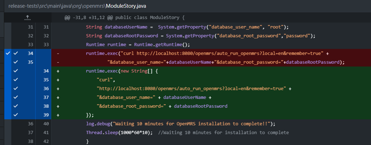

De bevinding lijkt een false positive of een laag-risico issue te zijn. De gebruikte waarden zijn afkomstig van JVM-systeemeigenschappen binnen de testinfrastructuur en niet van externe gebruikersinvoer. Daarnaast wordt Runtime.exec() direct aangeroepen en niet via een shell, waardoor command injection aanzienlijk wordt beperkt.

Desondanks is de code aangepast naar Runtime.exec(String\[\]) om aan de CodeQL-regel te voldoen en toekomstige risico's te voorkomen indien de herkomst van de invoer ooit verandert.

## Failure to use HTTPS or SFTP URL in Maven artifact upload/download #5, #6, #7

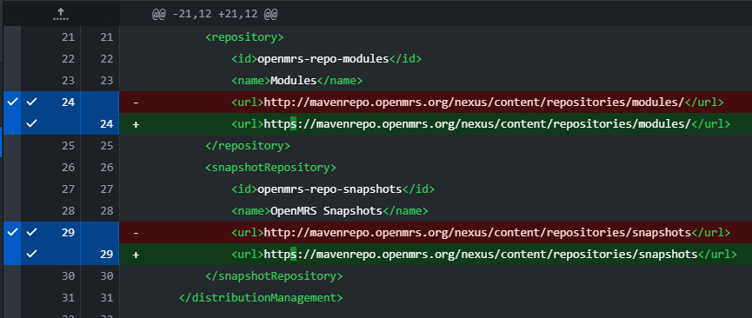

De bevinding is geldig omdat de POM een Maven-repository via HTTP benaderde.

Hoewel misbruik een netwerkgebaseerde man-in-the-middle-aanval vereist, dienen Maven-repositories via HTTPS benaderd te worden.

Deze bevinding is opgelost door de repository-URL te wijzigen naar HTTPS.

**Uncontrolled data used in path expression #9, #10, #11, #12**

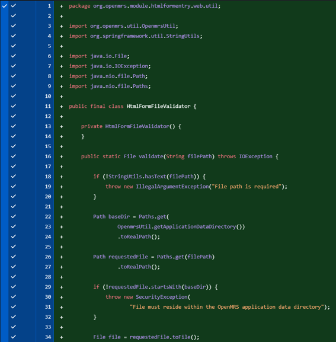
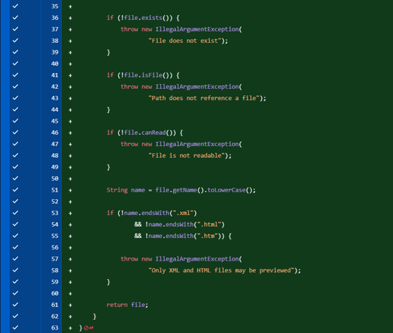
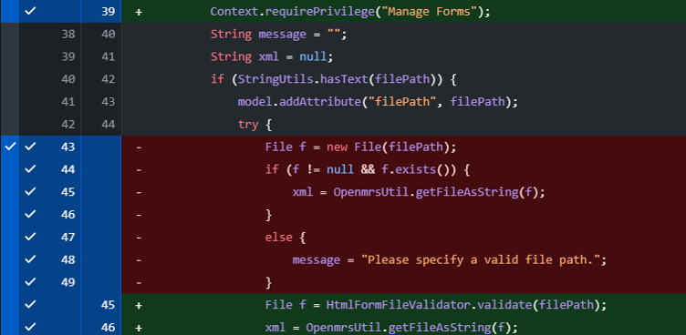
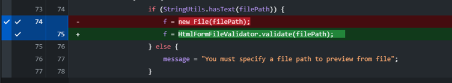

Deze kwetsbaarheid maakte het mogelijk om bestanden op het OpenMRS-serverbestandssysteem te lezen via een gebruikersgestuurd bestandspad.

Hoewel toegang beperkt was tot gebruikers met de privilege _Manage Forms_, zouden deze gebruikers geen onbeperkte toegang tot alle serverbestanden moeten hebben.

Om dit te mitigeren is bestandstoegang beperkt tot de OpenMRS application data directory waarin HTML/XML-formulieren worden opgeslagen.

Het pad wordt gevalideerd met een canonical path check om directory traversal-aanvallen te voorkomen.

Daarnaast is een bestandstypecontrole toegevoegd zodat alleen HTML- en XML-bestanden kunnen worden gelezen.

Omdat er al een uploadfunctie bestaat voor externe bestanden, beperkt deze wijziging de bestaande functionaliteit voor ontwikkelaars en formulierontwerpers niet.

## Polynomial regular expression used on uncontrolled data #3, #4

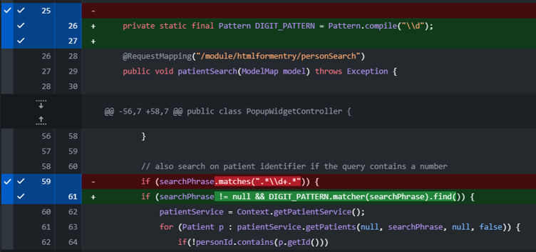
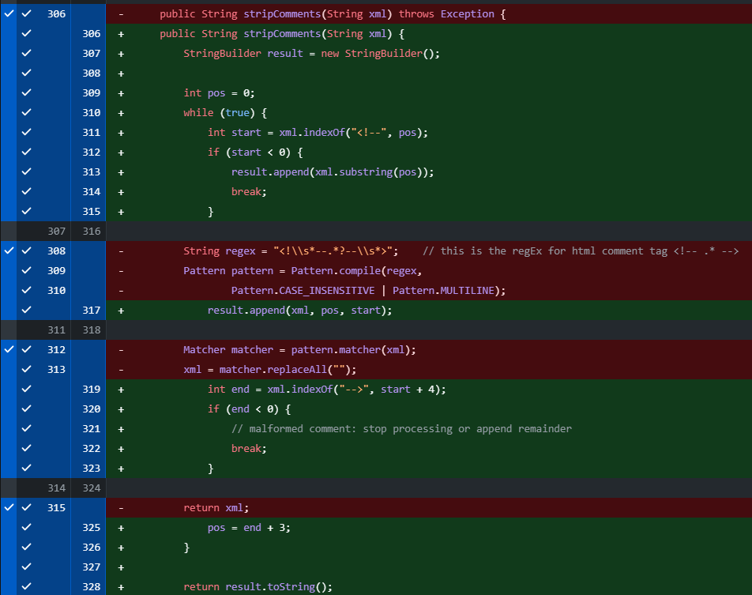

Deze bevinding werd veroorzaakt door het gebruik van een reguliere expressie op gebruikersgestuurde invoer. CodeQL markeerde dit als een mogelijk ReDoS-risico (java/polynomial-redos) vanwege overmatige backtracking.

Om dit te mitigeren is het oorspronkelijke patroon vervangen door een eenvoudiger en niet-ambigue reguliere expressie die dezelfde functionaliteit behoudt voor het detecteren van cijfers.

Hierdoor verdwijnt het potentiële prestatieprobleem zonder wijziging van het bestaande gedrag.

## Deserialization of user-controlled data #8

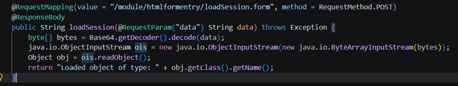

Deze endpoint maakte geen deel uit van de gedocumenteerde HTML Form Entry-workflow en voerde onveilige deserialisatie uit op gebruikersgestuurde data.

Door de endpoint te verwijderen is het aanvalsvlak volledig geëlimineerd en wordt CWE-502 (Deserialization of Untrusted Data) opgelost.

Het betrof een overblijfsel van een eerder project dat uiteindelijk niet is opgenomen in de uiteindelijke functionaliteit.

## Log Injection #15, #16, #17, #18

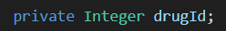
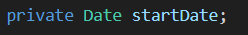

drugId is een Integer en startDate is een sterk getypeerde datumwaarde.

Geen van beide velden kan aanvallergestuurde regeleinden of logcontrolekarakters bevatten die nodig zijn voor log injection.

De bevinding wordt daarom beschouwd als een false positive.

## Local information disclosure in a temporary directory #14

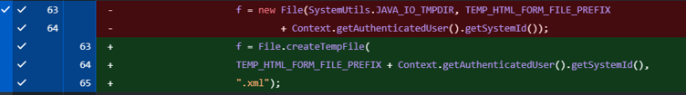

Het geüploade formulier werd voorheen opgeslagen onder een voorspelbare bestandsnaam in de systeem-tempdirectory.

Dit is aangepast naar het gebruik van Java's File.createTempFile() API, die een unieke tijdelijke bestandsnaam genereert en daarmee het risico op ongewenste toegang door andere lokale processen verkleint.

Het bestand wordt uitsluitend tijdelijk gebruikt voor het previewen van geüploade HTML-formulieren en is niet bedoeld voor langdurige opslag.

## Local information disclosure in a temporary directory #13

Deze bevinding bevindt zich in een unit test en heeft geen invloed op productiecode.

Het tijdelijke bestand wordt uitsluitend aangemaakt voor testuitvoering en is niet toegankelijk voor eindgebruikers.

Omdat het bestand alleen wordt gebruikt binnen een gecontroleerde testomgeving vormt deze melding geen beveiligingsrisico voor gedeployde OpenMRS-instanties en wordt deze beschouwd als een false positive.

## Unpinned tag for a non-immutable Action in workflow or composite action #1, #2

De OSV Scanner- en SBOM GitHub Actions zijn vastgezet op een specifieke commit-SHA in plaats van een wijzigbare versie-tag.

Hierdoor worden onbedoelde wijzigingen aan de Action-implementatie voorkomen en wordt het risico op supply-chain-aanvallen binnen de CI/CD-pijplijn verkleind.

