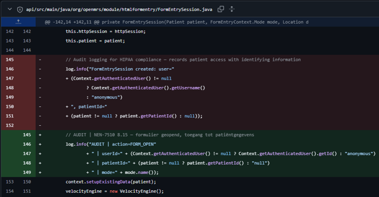
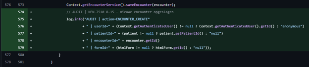
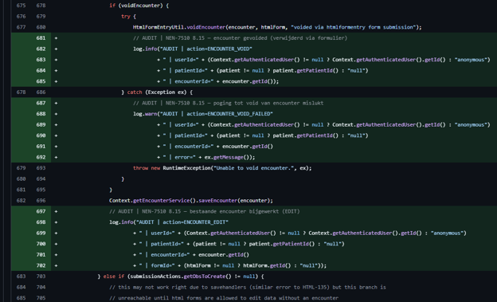
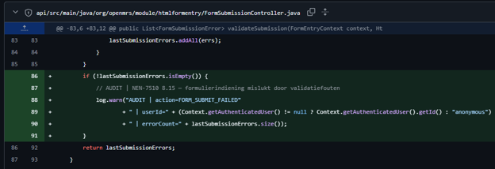
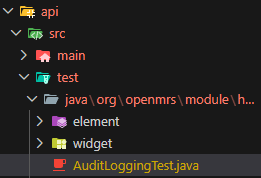

## Verantwoording logging & tests

### 1 Toegevoegd logging

In totaal zijn er 6 audit-logregels toegevoegd, verdeeld over twee klassen.

#### Bestand: FormEntrySession.java

De eerste log staat in de constructor en wordt getriggerd zodra een gebruiker een formulier opent. Er wordt gelogd met `action=FORM_OPEN`, inclusief het `userId` van de ingelogde gebruiker, het `patientId` en de modus (`ENTER`, `EDIT` of `VIEW`). De oorspronkelijke log die hier al stond logde de volledige gebruikersnaam — dit is aangepast naar alleen het numerieke `userId`, omdat een gebruikersnaam gevoelige data is.

De tweede log staat in `applyActions()` bij het aanmaken van een nieuwe encounter (`action=ENCOUNTER_CREATE`). Dit wordt gelogd wanneer een formulier succesvol wordt opgeslagen als nieuwe medische registratie, met `userId`, `patientId`, `encounterId` en `formId`.

De derde en vierde log zitten rondom het voiden van een encounter in EDIT-modus. Bij succes wordt `action=ENCOUNTER_VOID` gelogd, bij een fout `action=ENCOUNTER_VOID_FAILED`. De foutmelding van de exception wordt wel meegenomen in de log, maar bevat geen medische patiëntdata.

De vijfde log staat bij het bijwerken van een bestaande encounter in EDIT-modus (`action=ENCOUNTER_EDIT`), met dezelfde velden als bij `ENCOUNTER_CREATE`.

#### Bestand: FormSubmissionController.java

De zesde log staat in `validateSubmission()` en wordt alleen gelogd als er daadwerkelijk validatiefouten zijn (`action=FORM_SUBMIT_FAILED`). Er wordt gelogd hoeveel fouten er zijn (`errorCount`), maar niet wát de fouten zijn — de foutmeldingen kunnen namelijk ingevoerde patiëntwaarden bevatten.

Alle zes logs volgen hetzelfde formaat: `AUDIT | action=... | userId=... | ...`, wat het eenvoudig maakt om ze te filteren in een logbeheersysteem.

### 2 Tests

De tests staan in `AuditLoggingTest.java`. Om te kunnen controleren wat er gelogd wordt, is er een hulpklasse `TestAppender` gemaakt. Dit is een zelfgeschreven Log4j `AppenderSkeleton` die tijdens de test aan de root logger gekoppeld wordt via `LogManager.getRootLogger()`. Alle logberichten die door Log4j verwerkt worden — inclusief die van Commons Logging, waar `FormEntrySession` en `FormSubmissionController` intern gebruik van maken — worden daardoor onderschept en opgeslagen in een lijst in het geheugen. Na elke test wordt de appender weer losgekoppeld zodat andere tests er geen last van hebben.

#### Test 1 — formOpen_shouldLogAuditEntry

Er wordt een `FormEntrySession` aangemaakt met een testpatiënt (`patientId=2` uit de testdataset) en een minimale `HtmlForm` met een `Form`- en `EncounterType`-object, want de constructor crasht zonder die objecten. Dit is hetzelfde als wanneer een zorgverlener een formulier opent in OpenMRS. Daarna wordt via `appender.containsMessage("AUDIT | action=FORM_OPEN")` gecontroleerd of de log correct geplaatst is.

#### Test 2 — formOpen_shouldLogPatientIdButNotPatientName

Dezelfde opzet als test 1, maar nu worden twee assertions gedaan. Eerst wordt de volledige naam van de patiënt opgehaald via `patient.getPersonName().getFullName()`. Dan wordt gecontroleerd dat `patientId=2` wél in de log staat, en dat de naam nergens in de logoutput voorkomt. Dit verifieert dat de logging NEN-7510 8.15 compliant is op het gebied van gevoelige data.

#### Test 3 — validateSubmission_withErrors_shouldLogSubmitFailed

Er wordt een `FormSubmissionController` aangemaakt waaraan een `AlwaysFailingSubmissionAction` toegevoegd wordt — een nep-implementatie van `FormSubmissionControllerAction` die altijd één `FormSubmissionError` teruggeeft. Wanneer `validateSubmission()` aangeroepen wordt, loopt de controller door alle actions en verzamelt de fouten. Omdat de lijst niet leeg is, moet Log4j een `WARN`-bericht loggen met `AUDIT | action=FORM_SUBMIT_FAILED`. De test verifieert dit via de `TestAppender`.

#### Test 4 — validateSubmission_withoutErrors_shouldNotLogSubmitFailed

Dezelfde opzet als test 3, maar zonder actions toegevoegd aan de controller. De lijst met fouten blijft leeg, dus de log mag niet getriggerd worden. De test verifieert dat `FORM_SUBMIT_FAILED` afwezig is in de `TestAppender`.

#### Test 5 — auditLog_shouldContainUserIdNotUsername

De gebruikersnaam van de ingelogde testgebruiker wordt opgehaald via `Context.getAuthenticatedUser().getUsername()`. Na het aanmaken van de `FormEntrySession` wordt gecontroleerd dat de string `userId=` aanwezig is in de log, maar dat de gebruikersnaam zelf er niet in voorkomt. Dit garandeert dat de implementatie het numerieke ID logt in plaats van de loginnaam, wat een bewuste keuze is om gevoelige data uit de logs te houden.