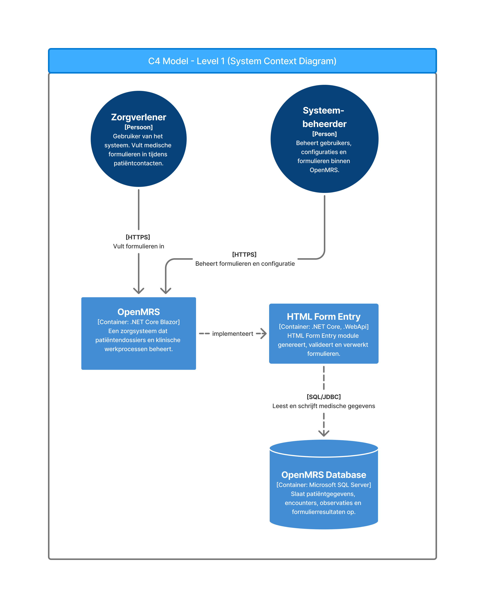
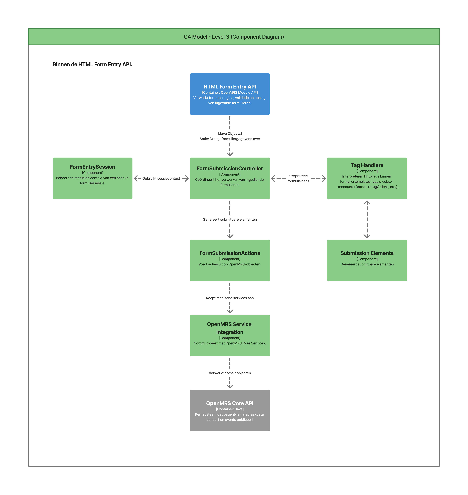
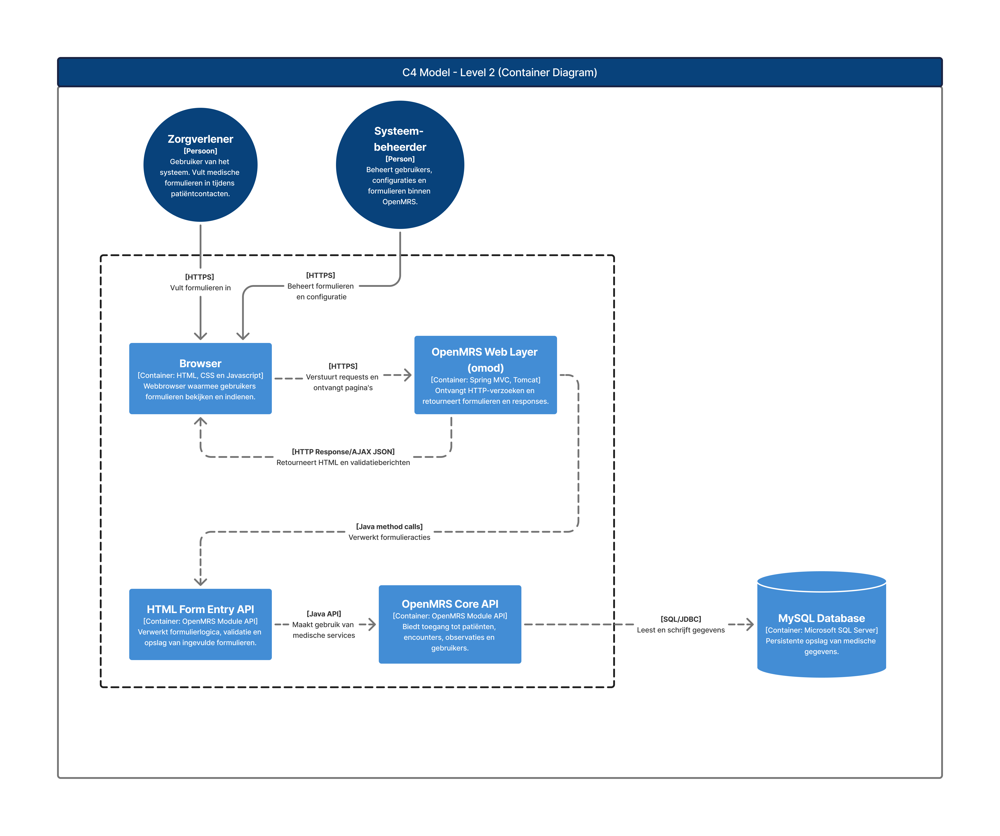
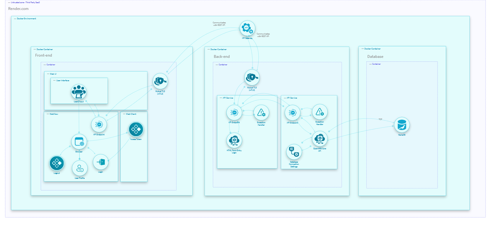

# Threat Model & System Diagrams

## 1. C4 Model

### 1.1 System Context Diagram

Bij het opstellen van het C4 Level 1 (System Context) diagram is gekeken naar de omgeving waarin de HTML Form Entry module van OpenMRS functioneert. Hierbij is inzichtelijk gemaakt welke gebruikers en externe systemen betrokken zijn en op welke manier zij met het systeem communiceren. Dit niveau geeft een hoog-over overzicht van de grenzen van het systeem en helpt bij het identificeren van mogelijke dreigingen vanuit externe partijen.

### 1.2 Container Diagram

In het C4 Level 2 (Container) diagram is ingezoomd op de interne opbouw van het systeem. De verschillende containers, zoals de web-laag, de HTML Form Entry module en de database, zijn hierin uitgewerkt. Daarnaast zijn de onderlinge relaties beschreven, zodat duidelijk wordt hoe gegevens door het systeem stromen en welke onderdelen verantwoordelijk zijn voor specifieke functionaliteiten.

### 1.3 Component Diagram

Het C4 Level 3 (Component) diagram richt zich op de belangrijkste componenten binnen de HTML Form Entry module. Door deze componenten en hun verantwoordelijkheden in kaart te brengen, ontstaat meer inzicht in de interne werking van de module. Dit detailniveau vormt tevens een goede basis voor het opstellen van het threat model, omdat potentiële kwetsbaarheden gekoppeld kunnen worden aan specifieke onderdelen van het systeem.

## 2. Threat Model

Voor deze opdracht is een threat model opgesteld voor de HTML Form Entry-module van OpenMRS met behulp van IriusRisk. Tijdens het modelleren werd duidelijk dat deze module niet los gezien kan worden van de rest van OpenMRS. Veel functionaliteit, zoals authenticatie, API-communicatie en databasekoppelingen, wordt namelijk door het onderliggende systeem verzorgd. Hierdoor identificeerde IriusRisk in totaal 158 mogelijke threats, waarvan een groot deel betrekking heeft op de algemene OpenMRS-architectuur en niet specifiek op de HTML Form Entry-module. Daarom is vooral gekeken naar threats die wel relevant zijn voor deze module, zoals onvoldoende invoervalidatie, onbevoegde toegang tot formulieren, manipulatie van ingevoerde gegevens en het verwerken van gevoelige patiëntinformatie. Hierbij is ook rekening gehouden met de eisen uit de NEN-7510 en de Cyber Resilience Act (CRA), waarbij onderwerpen zoals vertrouwelijkheid, toegangsbeheer en het veilig verwerken van medische gegevens een belangrijke rol spelen.

### Highlight threats

- **Ongeautoriseerde toegang tot de Docker-omgeving of containers:** Aanvallers kunnen toegang krijgen tot een Docker-container of de onderliggende omgeving. Hierdoor kunnen zij gevoelige gegevens inzien, processen manipuleren of misbruik maken van de applicatie.
- **Misconfiguratie van Docker-containers:** Onjuiste configuraties, zoals onnodig geopende poorten of het ontbreken van beveiligingsinstellingen, kunnen kwetsbaarheden introduceren die door aanvallers misbruikt kunnen worden.
- **Onvoldoende security hardening van clientsystemen:** Wanneer clientcomputers en browsers niet voldoende zijn gehard, kunnen bekende kwetsbaarheden worden misbruikt. Het toepassen van security hardening verkleint het aanvalsoppervlak en vermindert de kans op succesvolle aanvallen.
- **Overbelasting van containerresources (DDoS):** Een aanvaller kan grote hoeveelheden verkeer of verzoeken genereren, waardoor containers overbelast raken. Dit kan leiden tot prestatieproblemen of het tijdelijk onbeschikbaar worden van de applicatie.
- **Misconfiguratie van rechten en privileges:** Te ruime toegangsrechten binnen containers of applicaties kunnen ervoor zorgen dat gebruikers of processen meer bevoegdheden hebben dan nodig is. Dit vergroot de impact wanneer een account of container wordt gecompromitteerd.
- **Gevoeligheid voor Injection-aanvallen (OWASP Top 10):** Indien de HTML Form Entry-module invoer niet strikt valideert, kunnen kwaadaardige scripts (XSS) of database-injecties worden uitgevoerd. Dit kan ertoe leiden dat aanvallers ongeoorloofde toegang krijgen tot de MariaDB-database of schadelijke acties uitvoeren.

### Korte samenvatting

Uit de analyse met IriusRisk blijkt dat veel van de gevonden threats te maken hebben met de Docker-omgeving en de manier waarop OpenMRS is ingericht. Vooral verkeerde configuraties, te ruime rechten en aanvallen die de beschikbaarheid van het systeem kunnen beïnvloeden, springen eruit. Ook het goed beveiligen van clientapparaten en browsers blijft belangrijk, omdat kwetsbaarheden daarin misbruikt kunnen worden. Hoewel niet alle 158 gevonden threats direct van toepassing zijn op de HTML Form Entry-module, geven ze wel een goed beeld van de risico's binnen de omgeving waarin deze module draait. Deze aandachtspunten sluiten aan bij de eisen uit de NEN 7510 en de CRA, waarin veilige configuratie, toegangsbeheer en de continuïteit van systemen een belangrijke rol spelen.
